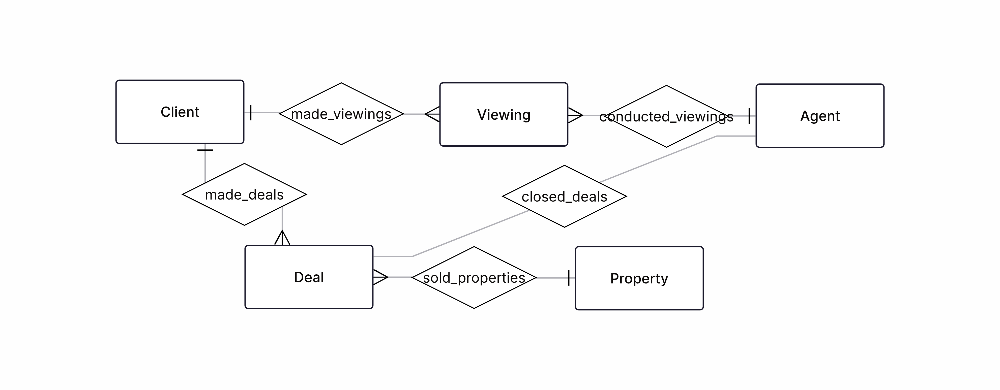
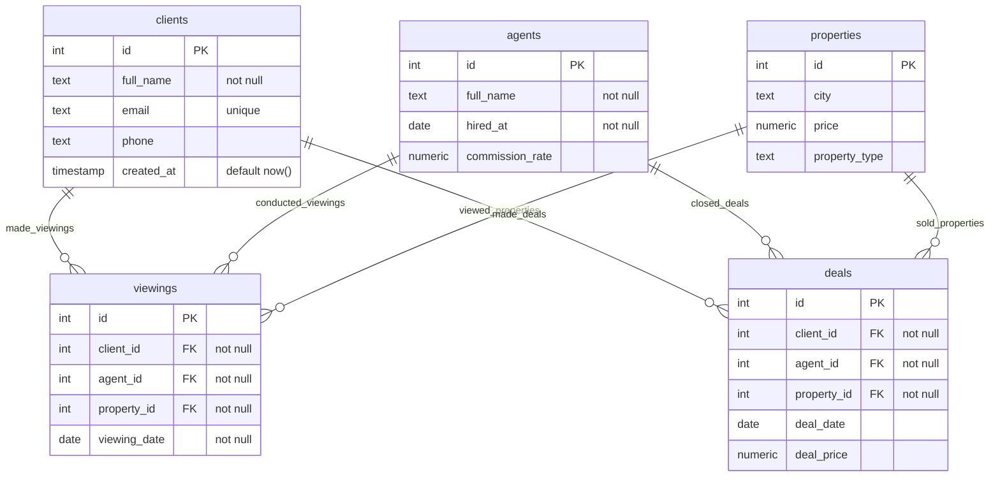

## Сервис подбора недвижимости (агентство)

Таблицы: clients, agents, properties, viewings (просмотры), deals.

Аналитические запросы:

1. Эффективность агентов: количество сделок, конверсия просмотров в сделки, средний чек.

2. Для клиентов — количество просмотров до сделки, выявить клиентов с нетипично долгим циклом.

### Схемы

Концептуальная модель:

Логическая модель:

